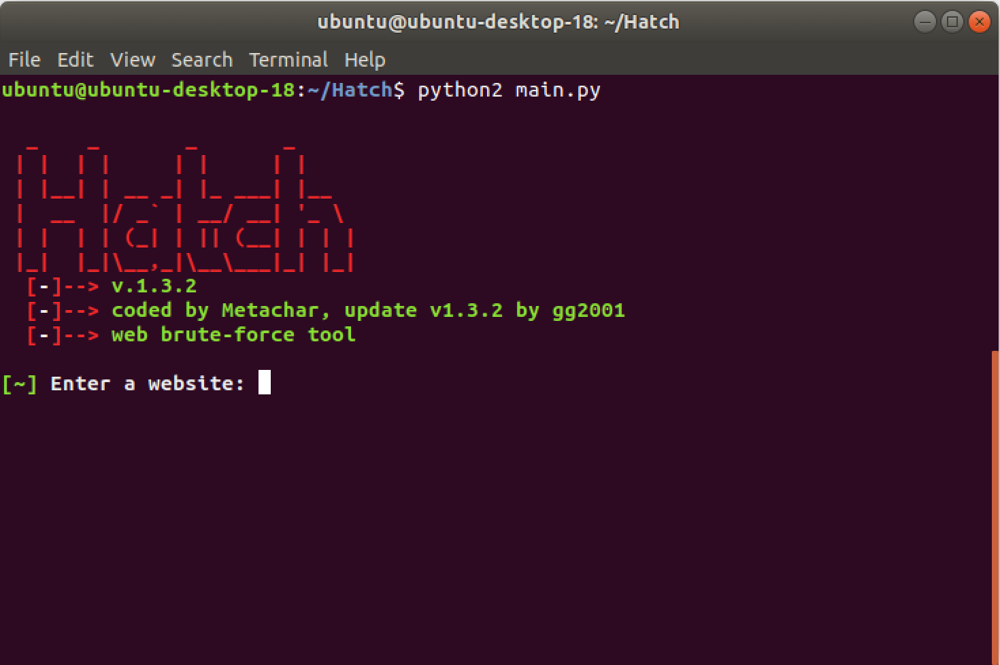

# Hatch
Hatch is a web login brute-force tool that works on most websites, written in Python 2.7.



## Update v.1.3.2
Removed the login button selector, and changed it so that the ENTER key is sent after entering the password.

## How to Use
Tested on Ubuntu 18.04 Desktop.
```
git clone https://github.com/gg2001/Hatch.git
cd Hatch
python2 main.py
```

Run this tool without arguments to open the wizard.
```
  -h, --help                  Show this help message and exit
  --username=USERNAME         Choose the username
  --usernamesel=USERNAMESEL   Choose the username selector
  --passsel=PASSSEL           Choose the password selector
  --passlist=PASSLIST         Enter the password list location
  --website=WEBSITE           Choose a website
```

1. Open the login page of a website.
2. Get a password list ready.
3. Copy the selector of the username and password input. (e.g. #username and #password)
4. Run the tool without arguments and enter the details in the wizard or run the tool with all the arguments.

Example:
```
python2 main.py --username=email@example.com --usernamesel=#username --passsel=#password --passlist=/home/ubuntu/passlist.txt --website=https://example.com/login
```

Here is an old [video](https://youtu.be/Hd_kQVnajxk) demonstration.

## Requirements
Ensure that python2 and pip2 are installed. These packages are required:
```
pip2 install selenium
pip2 install requests
```

Chrome and chromedriver are required:
```
sudo apt update
sudo apt install chromium-browser

wget https://chromedriver.storage.googleapis.com/2.41/chromedriver_linux64.zip
unzip chromedriver_linux64.zip
sudo mv chromedriver /usr/bin/chromedriver
sudo chown root:root /usr/bin/chromedriver
sudo chmod +x /usr/bin/chromedriver
```

If you installed chromedriver to a different location change the variable ```CHROME_DVR_DIR``` in the ```main.py``` file. 
